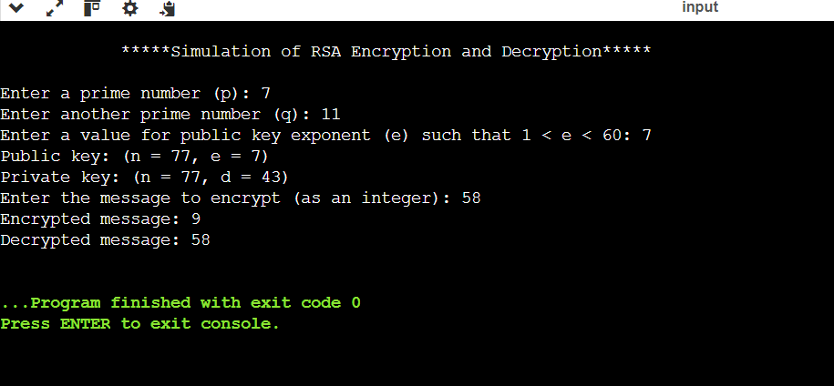

## EX.9 SIMULATION OF RSA ALGORITHM
## AIM:
To implement encryption and decryption using RSA algorithm.

## ALGORITHM:
•	Select 2 prime numbers p and q.

•	Calculate n and pi(n).

•	Choose small number e.

•	Calculate d.

•	Perform encryption and decryption and get the outputs correspondingly.

## PROGRAM:
```
#include <stdio.h>
#include <math.h>

// Function to calculate greatest common divisor (GCD)
int gcd(int a, int b) {
    while (b != 0) {
        int temp = b;
        b = a % b;
        a = temp;
    }
    return a;
}

// Function to calculate (base^exp) % mod using modular exponentiation
int mod_exp(int base, int exp, int mod) {
    int result = 1;
    base = base % mod;
    
    while (exp > 0) {
        if (exp % 2 == 1) {
            result = (result * base) % mod;
        }
        exp = exp >> 1;  // exp = exp / 2
        base = (base * base) % mod;
    }
    
    return result;
}

// Function to find the modular inverse using Extended Euclidean Algorithm
int mod_inverse(int e, int phi_n) {
    int t = 0, new_t = 1;
    int r = phi_n, new_r = e;
    
    while (new_r != 0) {
        int quotient = r / new_r;
        int temp_t = t;
        t = new_t;
        new_t = temp_t - quotient * new_t;
        
        int temp_r = r;
        r = new_r;
        new_r = temp_r - quotient * new_r;
    }
    
    if (r > 1) return -1;  // No inverse
    if (t < 0) t += phi_n;
    
    return t;
}

int main() {
    int p, q, n, phi_n, e, d;
    int message, encrypted_message, decrypted_message;
    
    printf("\n            *****Simulation of RSA Encryption and Decryption*****\n\n");
    // Get two prime numbers from the user
    printf("Enter a prime number (p): ");
    scanf("%d", &p);
    printf("Enter another prime number (q): ");
    scanf("%d", &q);
    
    // Calculate n and phi(n)
    n = p * q;
    phi_n = (p - 1) * (q - 1);
    
    // Choose the public key exponent e such that 1 < e < phi_n and gcd(e, phi_n) = 1
    do {
        printf("Enter a value for public key exponent (e) such that 1 < e < %d: ", phi_n);
        scanf("%d", &e);
    } while (gcd(e, phi_n) != 1);
    
    // Calculate the private key exponent d (modular inverse of e)
    d = mod_inverse(e, phi_n);
    if (d == -1) {
        printf("Modular inverse does not exist for the given 'e'. Exiting.\n");
        return 1;
    }
    
    printf("Public key: (n = %d, e = %d)\n", n, e);
    printf("Private key: (n = %d, d = %d)\n", n, d);
    
    // Get the message to encrypt
    printf("Enter the message to encrypt (as an integer): ");
    scanf("%d", &message);
    
    // Encrypt the message: ciphertext = (message^e) % n
    encrypted_message = mod_exp(message, e, n);
    printf("Encrypted message: %d\n", encrypted_message);
    
    // Decrypt the message: decrypted_message = (ciphertext^d) % n
    decrypted_message = mod_exp(encrypted_message, d, n);
    printf("Decrypted message: %d\n", decrypted_message);
    
    return 0;
}
```

## OUTPUT:
 

## RESULT:
	Hence, the simulation of RSA algorithm is successfully done.
